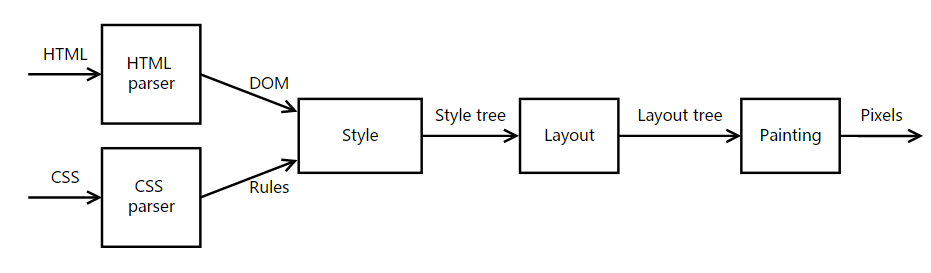

Part 4: Style
====
本模块以DOM结点和CSS规则作为输入，将它们匹配起来，对每一个DOM结点指定正确的CSS value。

格式树
----
style模块的输出可以称为格式树，树上的每一个结点包含一个DOM结点，和CSS value。
```python
class StyleNode(object):
    def __init__(self, node, specified_values, children):
        self.node = node
        self.specified_values = specified_values
        self.children = children
```
浏览器经常以一棵树作为输入，输出另一棵相关的树。例如，Gecko的layout代码以DOM tree作为输入，产生一个frame tree，可以用来构建view tree。
我们的流程大概如下图

选择器匹配
-----
构建style tree的第一步是选择器匹配，选择器匹配只需要遍历DOM tree，查看该element的兄弟姐妹结点。
```python
def matches(elementdata, selector):
    if isinstance(selector, css.SimpleSelector):
        return matches_simple_selector(elementdata, selector)
```
为了方便获取一些信息，我们在DOM结点处添加一些方法，方法`id`可以根据id获取属性值，方法`clazzes`返回一个含有class的list
```python
class ElementData(object):
    def id(self):
        if self.attributes.has_key('id'):
            return self.attributes['id']
        else:
            return None

    def clazzes(self):
        if self.attributes.has_key('class'):
            return self.attributes['class'].split(' ')
        else:
            return []
```
为了测试一个simple selector是否匹配一个element，只需要看看selector的组成就行了。
```python
def matches_simple_selector(elementdata, selector):
    if selector.tag_name != elementdata.tag_name:
        return False

    if selector.id != elementdata.id():
        return False

    elem_clazzes = elementdata.clazzes()
    for clazz in selector.clazz:
        if not elem_clazzes.__contains__(clazz):
            return False

    return True
```

构建style tree
---
我们需要遍历DOM tree，对于树中的每个节点，我们查找stylesheet，看有没有匹配的规则。当然可能一个element在两个规则中出现了，这时候我们使用特征值最高的选择器，因为我们的CSS parser是按照特征值从高到低排序的，所以，一旦找到了合适的，立即返回就行。
```python
def match_rule(elementdata, rule):
    for selector in rule.selectors:
        if(matches(elementdata, selector)):
            return (selector.specificity(), rule)
    return None
```
为了找出所有匹配element的规则，我们扫描样式表，检查每个规则，剔除那些不匹配的。在真实的浏览器中，可以通过把规则放在多个hash table中来加速这一过程。
```python
def matching_rules(elementdata, stylesheet):
    matchrules = []
    for rule in stylesheet.rules:
        result = match_rule(elementdata, rule)
        if result != None:
            matchrules.append(result)

    return matchrules

```
一旦我们完成了匹配，我们可以找到一个element的特定value，我们把每个规则的属性值插入到一个hashmap中，然后按照特征值排序。由于每一个elementdata可能有不同的规则和其匹配，遍历之后，高特征值能覆盖前面的。
```python
def specified_values(elementdata, stylesheet):
    values = {}
    rules = matching_rules(elementdata, stylesheet)

    def MyFn(s):
        return s[0]
    sorted(rules, key=MyFn)
    for (specifity, rule) in rules:
        for declaration in rule.declarations:
            values[declaration[0]] = declaration[1]

    return values

```
现在我们完成了准备工作。从根节点开始操作，如果是element类型，一定包含specified_value，否则设置为空。
```python
def style_tree(root, stylesheet):
    spvalues = ''
    children = []
    if isinstance(root, dom.Element):
        spvalues = specified_values(root.elementdata, stylesheet)
    elif isinstance(root, dom.Text):
        spvalues = {}

    for child in root.children :
        children.append(style_tree(child, stylesheet))

    return StyleNode(root, spvalues, children)

```
到这里，style模块就结束了，本模块的作用是把样式表中的规则和DOM结点结合起来，使得DOM结点具有格式，但是可能有好几条规则都指向了同一个element，这时候我们根据规定，给这些规则排序遍历，排在后面的规则可能会覆盖掉前面的值。

下一部分将会介绍layout模块。

