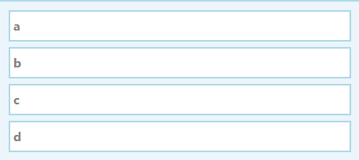
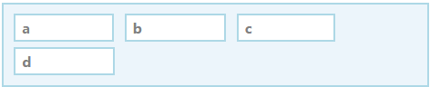
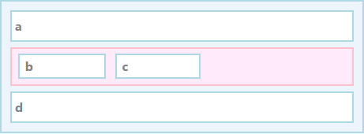

Part 5: Boxes
====
本模块的输入是上节的style tree，输出是layout tree。layout tree中是一系列的二维矩形。

Box模型
------
Layout中的内容全部是关于Box的，一个Box是一个矩形区域，含有宽高，位置信息，浏览器在这块区域上展示图片，视频等。

一个Box可能也含有padding，border，margins等信息，这些信息决定了一个Box的周围状况。这里建了三个类。
```python
class Dimensions(object):
    def __init__(self):
        self.content = Rect()
        self.padding = EdgeSizes()
        self.border = EdgeSizes()
        self.margin = EdgeSizes()
    def padding_box(self):
        return self.content.expanded_by(self.padding)
    def border_box(self):
        return self.padding_box().expanded_by(self.border)
    def margin_box(self):
        return self.border_box().expanded_by(self.margin)

class Rect(object):
    def __init__(self, x = 0, y = 0, width = 0, height = 0):
        self.x = x
        self.y = y
        self.width = width
        self.height = height
    def expanded_by(self, edge):
        return Rect(self.x - edge.left, self.y - edge.top, self.width + edge.left + edge.right,
                    self.height + edge.top + edge.bottom)

class EdgeSizes(object):
    def __init__(self, left=0, right=0, top=0, bottom=0):
        self.left = left
        self.right = right
        self.top = top
        self.bottom = bottom

```

Block和Inline layout
----
在CSS中，`display`属性决定了element生成哪种类型的box，CSS有很多box类型，这里只讨论两种，block和inline。
对于一段HTML代码，举例如下：
```html
<container>
  <a></a>
  <b></b>
  <c></c>
  <d></d>
</container>
```
如果都是block类型，每个box将从上到下垂直排列在容器中。即CSS代码`a, b, c, d { display: block; }`将会展示如下：


如果都是inline类型，每个box从左到右水平排列在容器中，如果到达了容器的右边界，将另起一行。CSS代码`a, b, c, d { display: inline; }`


每一个box必须要么只包含block类型的子节点，要么只是inline类型的子节点。如果一个element包含了混合类型的子节点，将插入一个anonymous box来把这两个类型分开。
例如CSS代码:
```html
a    { display: block; }
b, c { display: inline; }
d    { display: block; }
```
产生如下效果：


其实比较容易看出来，一个block的宽度取决于容器的宽度，容器的高度取决于子节点的高度。

Layout tree
-----
layout tree是box的集合，包含有这个box的规模，以及很多个子节点。
```python
class LayoutBox(object):
    def __init__(self, box_type):
        self.dimensions = Dimensions()
        self.box_type = box_type
        self.children = []
```
当然一个box可能是block类型的，也可能是inline类型的，也有可能是anonymous类型的。
```python
class BoxType:
    def __init__(self, style_node):
        self.style_node = style_node

class BlockNode(BoxType):
    def __init__(self, style_node):
        BoxType.__init__(self, style_node)

class InlineNode(BoxType):
    def __init__(self, style_node):
        BoxType.__init__(self, style_node)

class AnonymousBlock(BoxType):
    pass
```
当然，为了构造layout tree，我们需要遍历DOM结点，获取其中`display`属性的值，在StyleNode类中添加如下方法，如果没有指定任何，则返回inline类型。
```python
def display(self):
        if self.specified_values.has_key('display'):
            value = self.specified_values('display')
            if value == 'block' or value == 'none':
                return value
            else:
                return 'inline'
        else:
            return 'inline'

```
现在可以遍历style tree了，为每个node生成一个layout box，如果一个node的`display`设置为了`none`，则不包含在layout tree中。
```python
def build_layout_tree(style_node):
    # create root box
    if style_node.display() == 'block':
        box_type = BlockNode(style_node)
    elif style_node.display() == 'inline':
        box_type = InlineNode(style_node)
    else:
        raise SyntaxError('Root node has display: none')
    root = LayoutBox(box_type)

    for child in style_node.children:
        if child.display() == 'block':
            root.children.append(build_layout_tree(child))
        elif child.display() == 'inline':
            root.get_inline_container().children.append(build_layout_tree(child))
        else:
            pass

    return root
```
如果一个block含有一个inline的子节点，则创建一个anonymous的block来包含它，如果已经已经有一些的inline了，则把其加入。
```python
def get_inline_container(self):
        if isinstance(self.box_type, InlineNode) or isinstance(self.box_type, AnonymousBlock):
            return self
        else:
            if isinstance(self.children[-1], AnonymousBlock):
                return self.children[-1]
            else:
                self.children.append(LayoutBox(AnonymousBlock))
                return self.children[-1]
```


